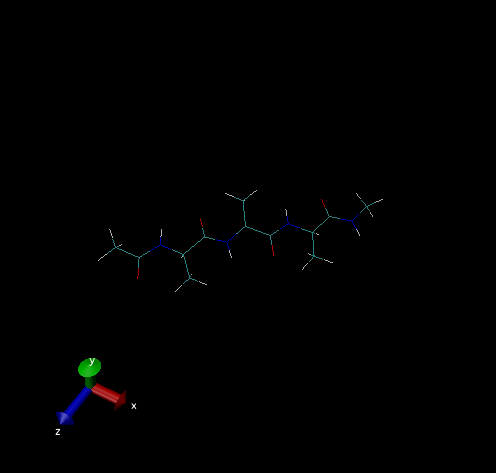

# Xponge

## 简介
Xponge是由Python编写的轻量化能高度自定义的分子动力学模拟的前后处理工具。Python版本需大于3.6，安装直接使用pip即可
```bash
pip install Xponge
```
安装成功以后，在Python脚本中直接`import`即可使用
```python
import Xponge
```
Xponge最基本的功能除了依赖于python的标准库外，还依赖了numpy、pubchempy，这两个包将会在pip install Xponge时将会自动安装，而一些更复杂的功能可能包括其他模块，这些模块需要自行安装。

Xponge目前还处于早期开发版本，此处介绍一些基本功能，不代表最终版本效果。

## 分子动力学模拟系统的初始构建
### 1. 现有力场，现有残基，无初始坐标文件

- 引入现有力场
```python
import Xponge
import Xponge.forcefield.AMBER.ff14SB
```
会得到包含参考文献的打印信息
```python
Reference for ff14SB.py:
  James A. Maier, Carmenza Martinez, Koushik Kasavajhala, Lauren Wickstrom, Kevin E. Hauser, and Carlos Simmerling
    ff14SB: Improving the accuracy of protein side chain and backbone parameters from ff99SB
    Journal of Chemical Theory and Computation 2015 11 (8), 3696-3713
    DOI: 10.1021/acs.jctc.5b00255
```

- 查看现有残基
```python
print(Xponge.ResidueType.types)
```
得到结果：
```
{'ACE': Type of Residue: ACE, 'ASH': Type of Residue: ASH, 'CYM': Type of Residue: CYM, 'GLH': Type of Residue: GLH, 'LYN': Type of Residue: LYN, 'NME': Type of Residue: NME, 'NALA': Type of Residue: NALA, 'ALA': Type of Residue: ALA, 'CALA': Type of Residue: CALA, 'NARG': Type of Residue: NARG, 'ARG': Type of Residue: ARG, 'CARG': Type of Residue: CARG, 'NASN': Type of Residue: NASN, 'ASN': Type of Residue: ASN, 'CASN': Type of Residue: CASN, 'NASP': Type of Residue: NASP, 'ASP': Type of Residue: ASP, 'CASP': Type of Residue: CASP, 'NCYS': Type of Residue: NCYS, 'CYS': Type of Residue: CYS, 'CCYS': Type of Residue: CCYS, 'NCYX': Type of Residue: NCYX, 'CYX': Type of Residue: CYX, 'CCYX': Type of Residue: CCYX, 'NGLN': Type of Residue: NGLN, 'GLN': Type of Residue: GLN, 'CGLN': Type of Residue: CGLN, 'NGLU': Type of Residue: NGLU, 'GLU': Type of Residue: GLU, 'CGLU': Type of Residue: CGLU, 'NGLY': Type of Residue: NGLY, 'GLY': Type of Residue: GLY, 'CGLY': Type of Residue: CGLY, 'NHID': Type of Residue: NHID, 'HID': Type of Residue: HID, 'CHID': Type of Residue: CHID, 'NHIE': Type of Residue: NHIE, 'HIE': Type of Residue: HIE, 'CHIE': Type of Residue: CHIE, 'NHIP': Type of Residue: NHIP, 'HIP': Type of Residue: HIP, 'CHIP': Type of Residue: CHIP, 'NHE': Type of Residue: NHE, 'HYP': Type of Residue: HYP, 'CHYP': Type of Residue: CHYP, 'NILE': Type of Residue: NILE, 'ILE': Type of Residue: ILE, 'CILE': Type of Residue: CILE, 'NLEU': Type of Residue: NLEU, 'LEU': Type of Residue: LEU, 'CLEU': Type of Residue: CLEU, 'NLYS': Type of Residue: NLYS, 'LYS': Type of Residue: LYS, 'CLYS': Type of Residue: CLYS, 'NMET': Type of Residue: NMET, 'MET': Type of Residue: MET, 'CMET': Type of Residue: CMET, 'NPHE': Type of Residue: NPHE, 'PHE': Type of Residue: PHE, 'CPHE': Type of Residue: CPHE, 'NPRO': Type of Residue: NPRO, 'PRO': Type of Residue: PRO, 'CPRO': Type of Residue: CPRO, 'NSER': Type of Residue: NSER, 'SER': Type of Residue: SER, 'CSER': Type of Residue: CSER, 'NTHR': Type of Residue: NTHR, 'THR': Type of Residue: THR, 'CTHR': Type of Residue: CTHR, 'NTRP': Type of Residue: NTRP, 'TRP': Type of Residue: TRP, 'CTRP': Type of Residue: CTRP, 'NTYR': Type of Residue: NTYR, 'TYR': Type of Residue: TYR, 'CTYR': Type of Residue: CTYR, 'NVAL': Type of Residue: NVAL, 'VAL': Type of Residue: VAL, 'CVAL': Type of Residue: CVAL, 'HIS': Type of Residue: HIE, 'NHIS': Type of Residue: NHIE, 'CHIS': Type of Residue: CHIE}
```
- 使用现有残基构建初始结构

残基类（Xponge.ResidueType）、残基（Xponge.Residue）、分子（Xponge.Molecule）之间，可以使用`+`进行连接获得分子（Xponge.Molecule），也可以`*`整数（int）进行多次自我连接。连接规则由刚才import的力场文件决定。
```python
protein = ACE + ALA * 3 + NME  
```

- 保存输出

残基类（Xponge.ResidueType）、残基（Xponge.Residue）、分子（Xponge.Molecule）可以使用`Save_PDB`、`Save_SPONGE_Input`、`Save_Mol2`、`Save_NPZ`分别保存为对应的文件格式。
```python
Save_PDB(protein, "protein.pdb")
Save_SPONGE_Input(protein, "protein")
```
使用VMD观看保存的PDB
```bash
vmd protein.pdb
```
或利用vmd的SPONGE插件
```bash
vmd -sponge_mass ./protein_mass.txt -sponge_crd ./protein_coordinate.txt
```
可获得如下结果



- 动力学模拟

此处仅作示例，因此保存的分子较小，人为修改生成的protein_coordinate.txt文件的最后一行，将盒子的长度改为50.0，以避免过小的周期性边界造成的影响。

修改好后，新建"mdin.txt"文件，并填写
```plain
basic test of Xponge
    mode = NVT
    thermostat = Andersen_thermostat
    dt = 2e-3
    constrain_mode = SHAKE
    cutoff = 8.0
    step_limit = 5000
    coordinate_in_file = protein_coordinate.txt
    angle_in_file = protein_angle.txt
    bond_in_file = protein_bond.txt
    charge_in_file = protein_charge.txt
    dihedral_in_file = protein_dihedral.txt
    exclude_in_file = protein_exclude.txt
    LJ_in_file = protein_LJ.txt
    mass_in_file = protein_mass.txt
    nb14_in_file = protein_nb14.txt
    residue_in_file = protein_residue.txt
```
使用SPONGE运行，获得如下结果
```plain
---------------------------------------------------------------------------------------
        step =         1000,         time =        2.000,  temperature =       305.35,
   potential =        47.21,           LJ =        -3.73,          PME =      -232.74,
     nb14_LJ =        26.62,      nb14_EE =       196.30,         bond =        12.74,
       angle =        16.63,     dihedral =        32.51,
---------------------------------------------------------------------------------------
        step =         2000,         time =        4.000,  temperature =       194.94,
   potential =        51.01,           LJ =        -2.02,          PME =      -229.18,
     nb14_LJ =        30.27,      nb14_EE =       188.48,         bond =        12.04,
       angle =        22.31,     dihedral =        30.75,
---------------------------------------------------------------------------------------
        step =         3000,         time =        6.000,  temperature =       246.57,
   potential =        49.60,           LJ =        -4.42,          PME =      -222.75,
     nb14_LJ =        31.28,      nb14_EE =       189.09,         bond =        11.10,
       angle =        16.47,     dihedral =        30.80,
---------------------------------------------------------------------------------------
        step =         4000,         time =        8.000,  temperature =       273.81,
   potential =        55.53,           LJ =        -4.54,          PME =      -231.54,
     nb14_LJ =        30.79,      nb14_EE =       196.70,         bond =         9.60,
       angle =        18.88,     dihedral =        29.40,
---------------------------------------------------------------------------------------
        step =         5000,         time =       10.000,  temperature =       344.12,
   potential =        48.44,           LJ =        -5.35,          PME =      -230.99,
     nb14_LJ =        29.09,      nb14_EE =       198.53,         bond =         6.32,
       angle =        19.48,     dihedral =        31.79,
---------------------------------------------------------------------------------------
```
> 部分内容在后续例子中相同，后续例子只在有必要的时候展示重复操作的结果部分。
- 该部分完整python代码
```python
import Xponge
import Xponge.forcefield.AMBER.ff14SB
protein = ACE + ALA * 3 + NME
Save_PDB(protein, "protein.pdb")
Save_SPONGE_Input(protein, "protein")
```

### 2. 现有力场，现有残基，有初始坐标

目前推荐是从PDB文件中读入

- 引入现有力场
```python
import Xponge
import Xponge.forcefield.AMBER.ff14SB
```

- 读入现有文件
> [示例pdb文件](https://gitee.com/gao_hyp_xyj_admin/xponge/blob/master/0.15_80_10_pH6.5_6lzg.result.pdb)：由H++补氢并添加了SSBOND信息的新冠病毒Spike蛋白与ACE2受体结合的PDB
```python
protein = loadpdb("0.15_80_10_pH6.5_6lzg.result.pdb")
```
- 该部分完整python代码
```python
import Xponge
import Xponge.forcefield.AMBER.ff14SB
protein = loadpdb("0.15_80_10_pH6.5_6lzg.result.pdb")
Save_PDB(protein, "protein.pdb")
Save_SPONGE_Input(protein, "protein")
```

> 注意事项
> 1. PDB文件格式是标准化的，修改前请确认理解PDB的格式
> 2. 从Protein Data Bank下载的PDB文件不包含氢，目前SPONGE不支持自动补氢，请手动或使用其他工具（如[H++](http://biophysics.cs.vt.edu/)）补氢。补氢时需要注意氢的命名需与标准相同
> 3. H++产生的PDB不包含SSBOND，需自行将原始PDB中SSBOND部分添加至H++产生的PDB中，Xponge能自动将二硫键的半胱氨酸残基更名。另外，Xponge能够自动根据质子判断组氨酸的残基名

### 3. 现有力场，现有力场参数，非现有残基，非现有残基单独成分子，已知残基的各项信息

只需要构建好残基类（Xponge.ResidueType），将非现有残基转化为现有残基

以gaff力场下的自定义水为例

  - 方案1 从mol2文件中构建

编写mol2文件
```mol2
@<TRIPOS>MOLECULE
TP3
    3     2     1     0     1 
SMALL
USER_CHARGES
@<TRIPOS>ATOM
  1 O       0.000000    0.000000    0.000000 oh    1 WAT    -0.8340 ****
  2 H1      0.957200    0.000000    0.000000 ho    1 WAT     0.4170 ****
  3 H2     -0.239988    0.926627    0.000000 ho    1 WAT     0.4170 ****
@<TRIPOS>BOND
    1     1     2 1
    2     1     3 1
@<TRIPOS>SUBSTRUCTURE
      1  WAT              1 ****               0 ****  **** 
```
然后在python中
```python
import Xponge
import Xponge.forcefield.AMBER.gaff
TP3 = loadmol2("WAT.mol2")
Save_SPONGE_Input(TP3, "tp3")
```
> Xponge会根据mol2文件中的残基名（此例中的"WAT"）在内部添加残基类（Xponge.ResidueType），而loadmol2最后会返回的（此例中的"TP3"）是包含该mol2中所有残基的分子（Xponge.Molecule）。参与PDB中残基识别只与残基类（Xponge.ResidueType）有关。
- 方案2 python代码构建
```python
#构建新的空残基类
import Xponge
import Xponge.forcefield.AMBER.gaff
WAT = Xponge.ResidueType(name = "WAT")
#添加原子信息
WAT.Add_Atom(name = "O", atom_type = Xponge.AtomType.types["oh"], x = 0, y = 0, z = 0)
WAT.O.Update(**{"charge[e]": -0.8340})
WAT.Add_Atom(name = "H1", atom_type = Xponge.AtomType.types["ho"], x = 0.9572, y = 0, z = 0)
WAT.H1.Update(**{"charge[e]": 0.4170})
WAT.Add_Atom(name = "H2", atom_type = Xponge.AtomType.types["ho"], x = -0.239988, y = 0.926627, z = 0)
WAT.H2.Update(**{"charge[e]": 0.4170})
#添加连接信息
WAT.Add_Connectivity(WAT.O, WAT.H1)
WAT.Add_Connectivity(WAT.O, WAT.H2)

Save_SPONGE_Input(WAT, "TP3")
```